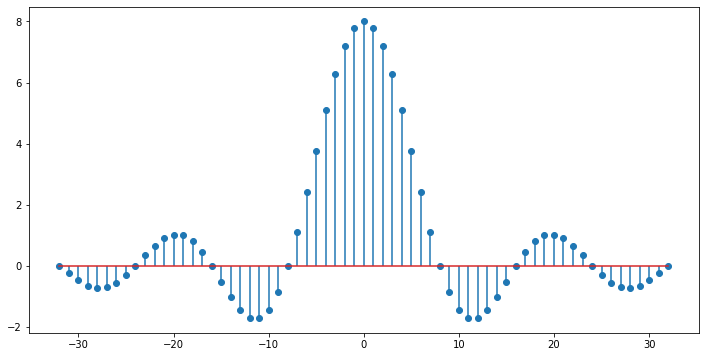

.. -*- coding: utf-8 -*-

.. _rcs_subversion:

Clase 04 - PIII 2023
====================
(Fecha: 14 de septiembre)

Registro en video de algunos temas de la clase de hoy
^^^^^^^^^^^^^^^^^^^^^^^^^^^^^^^^^^^^^^^^^^^^^^^^^^^^^

`PIII 2023 - Reproducir audio en Colab - Ejercicios <https://youtu.be/uO1MHvWEISc>`_

Cuadernos de código y herramientas
==================================

- Jupyter Notebook
- Anaconda
- Google Colab

**Algunos ejemplos del uso de matplotlib**

.. code-block:: python

	import numpy as np
	import matplotlib.pyplot as plt

	# Variables independientes
	x1 = np.linspace( 1, 12, 12 )
	x2 = np.linspace( 1, 12, 12 ) + 2
	x3 = np.linspace( 1, 12, 12 )
	x4 = x2 + x3

	# Para varios gráficos es útil usar la función subplots y luego axs
	# Documentación de subplots en: https://matplotlib.org/stable/api/_as_gen/matplotlib.pyplot.subplots.html
	fig, axs = plt.subplots( nrows = 2, ncols = 2 )  
	fig.set_figwidth( 10 )
	fig.set_figheight( 6 )

	axs[ 0, 0 ].plot( x1, x2 )
	axs[ 0, 0 ].set_title( 'Gráfico 1' )
	axs[ 0, 0 ].set_xlabel( 'x' )
	axs[ 0, 0 ].set_ylabel( 'y' )

	axs[ 0, 1 ].plot( x1, x3 )
	axs[ 0, 1 ].set_title( 'Gráfico 2' )
	axs[ 0, 1 ].set_xlabel( 'x' )
	axs[ 0, 1 ].set_ylabel( 'y' )

	axs[ 1, 0 ].plot( x1, x4 )
	axs[ 1, 0 ].set_title( 'Gráfico 3' )
	axs[ 1, 0 ].set_xlabel( 'x' )
	axs[ 1, 0 ].set_ylabel( 'y' )

	axs[ 1, 1 ].scatter( x1, x4 )  # scatter plot = Diagrama de dispersión
	axs[ 1, 1 ].set_title( 'Gráfico 4' )
	axs[ 1, 1 ].set_xlabel( 'x' )
	axs[ 1, 1 ].set_ylabel( 'y' )

	plt.show()

.. code-block:: python

	import numpy as np
	import matplotlib.pyplot as plt

	x1 = np.linspace( 1, 12, 12 )
	x2 = np.linspace( 1, 12, 12 ) + 2

	fig, axs = plt.subplots( nrows = 2, ncols = 2 )  

	axs[ 0, 0 ].plot( x1, x2 )
	axs[ 0, 1 ].plot( x1, x2, 'g--d' )  
	axs[ 1, 0 ].scatter( x1, x2 )  
	axs[ 1, 1 ].stem( x1, x2 )
	plt.show()

Ejercicio 1
===========

- Considerar una señal continua senoidal de 1 kHz con amplitud de -5 a 5. Graficar sólo 10 ms de esta señal continua.
- Muestrearla a 50.000 samples por segundos. Graficar las primeras 50 muestras sin cuantificar.
- Graficar estas 50 muestras de la secuencia cuantificada considerando un ADC de 12 bits.
- Mostrar estas 3 gráficas en un sólo ploteo.

`Iteraciones y decisiones (ipynb) <https://colab.research.google.com/drive/1u-X1uIGoHCKf_QRb1jTdBZ_Ap_Z7hhYq?usp=sharing>`_ 
================================

**Sentencia if**

.. code-block:: python

	edad = int( input( 'Ingrese edad: ' ) )

	if edad < 0 :
	    print( 'Error' )
	elif edad < 18 :
	    print( 'Menor de edad' )
	else :
	    print( 'Mayor de edad' )

	# Operadores para comparar: ==  !=  <  >  <=  >=

**Sentencia for**

.. code-block:: python

	suma = 0
	mis_numeros = [ 4, 8, 12, 18 ] 

	# la variable numero designará a los elementos de la lista
	for numero in mis_numeros :
	    suma = suma + numero
	    print( 'Esto se imprime en cada ciclo. Suma parcial =', suma )

	print( 'Esto se imprime fuera del ciclo' )
	print( 'La lista es:', mis_numeros )
	print( 'La suma de los números de la lista es:', suma )

	print( '\nUn for para range de 0 a 3' )
	for i in range( 4 ) :
    	print( i )

    imagenes = [ 'impulso.jpg', 'gráficos.png', 'esquema.jpg' ]
	for imagen in imagenes :
	    print ( '\nEl nombre de la imagen es: {0} y el largo ' \
	            'del nombre es: {1}'.format( imagen, len( imagen ) ) )    

	mi_lista = [ 'manzana', 'bananas', 'uvas', 'peras' ]
	# La primera variable (c en nuestro caso) es el contador
	# La segunda variable (valor en nuestro caso) es precisamente el valor almacenado en cada posición
	# El segundo parámetro de eumerate es desde dónde comienza la enumeración 
	for c, valor in enumerate( mi_lista, 0 ) :
	    print( '\n', c, valor )

**Sentencia while**

.. code-block:: python

	n = 5
	print( 'Loop 1 started.' )
	while n > 0 :
	    n -= 1
	    if n == 2 :
	        break
	    print( n )
	print( 'Loop 1 ended.' )

	n = 5
	print( 'Loop 2 started.' )
	while n > 0 :
	    n -= 1
	    if n == 2 :
	        continue
	    print( n )
	print( 'Loop 2 ended.' )

`Sonidos humanamente audibles (ipynb) <https://colab.research.google.com/drive/1CZ_HpWmftsejvJAuUKM54AiCrQVE1km-?usp=sharing>`_ 
=====================================

- Aproximadamente entre 20 Hz y 20 kHz

.. code-block:: python

	import numpy as np

	# Para reproducir audio en la notebook.
	from IPython.display import Audio, display

	sample_rate = 44100

	segundos_de_audio = 2
	n = np.linspace( 0, segundos_de_audio, sample_rate * segundos_de_audio )
	tono = 440
	data = np.sin( 2 * np.pi * tono * n )

	data

	def generador_de_tono( frecuencia, duracion, sample_rate, A = 1 ) :
	    n = np.linspace( 0, duracion, sample_rate * duracion )
	    return np.sin( 2 * np.pi * frecuencia * n )

	la440 = generador_de_tono( 440, 1, 44100 )

	Audio( data = la440, rate = 44100 )

	# Todas las notas comenzando desde el 'La'
	#   La La# Si Do Do# Re Re# Mi Fa Fa# Sol Sol# La
	n_0 = 440
	notas = [ 440 * 2**( n / 12 ) for n in range( 0, 13 ) ]

	# Tono de cada nota
	muestras_de_todas_las_notas = [] 
	for frecuencia_de_nota in notas : 
	     muestras_de_todas_las_notas.append( generador_de_tono( frecuencia_de_nota, 1, 44100 ) )

	index_notas = [ 0, 2, 4, 5, 7, 9, 11, 12 ]
	escala_La_mayor = [ muestras_de_todas_las_notas[ i ] for i in index_notas ]

	muestras_escala_La_mayor = np.concatenate( escala_La_mayor )

	Audio( muestras_escala_La_mayor, rate = 44100 )

Ejercicio 2
===========

- Replicar exactamente la siguiente secuencia:

- Reproducir la escala pentatónica menor de La
- Buscar información donde desee.
- Deben sonar las notas que se pueden escuchar `Aquí <https://es.wikipedia.org/wiki/Archivo:PentMinor.mid>`_ 

