.. -*- coding: utf-8 -*-

.. _rcs_subversion:

Clase 07 - PIII 2023
====================
(Fecha: 12 de octubre)

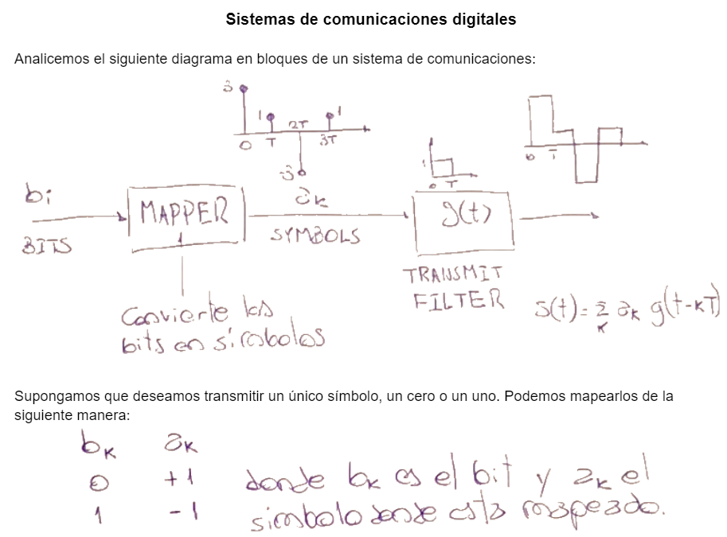

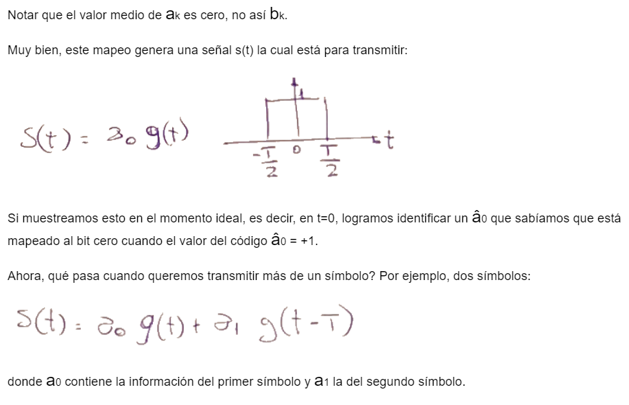

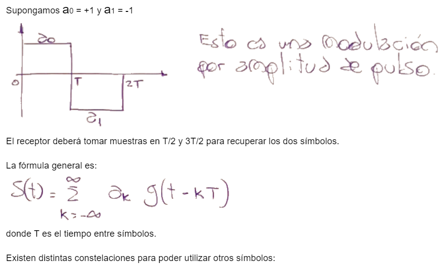

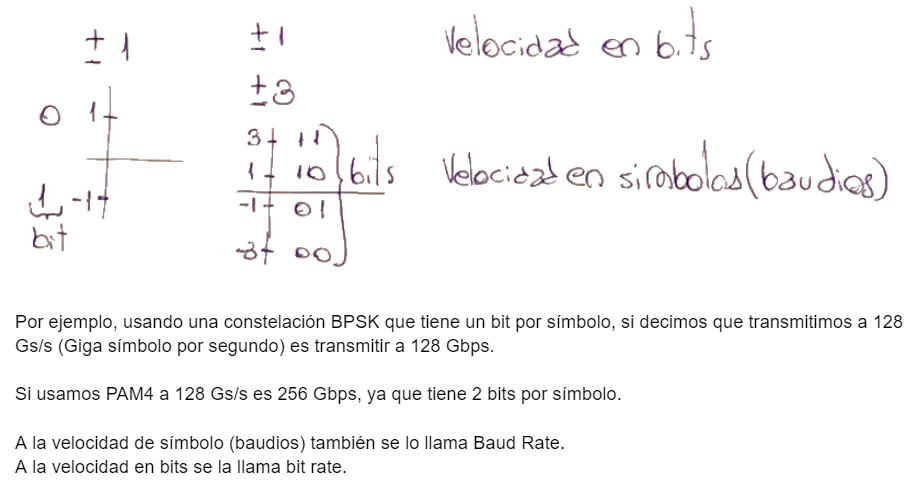

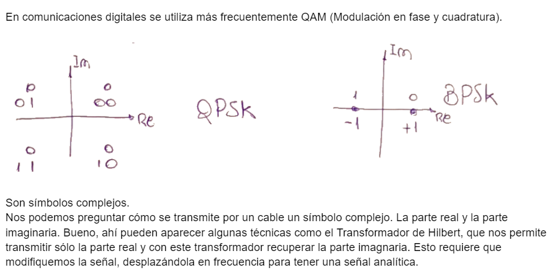

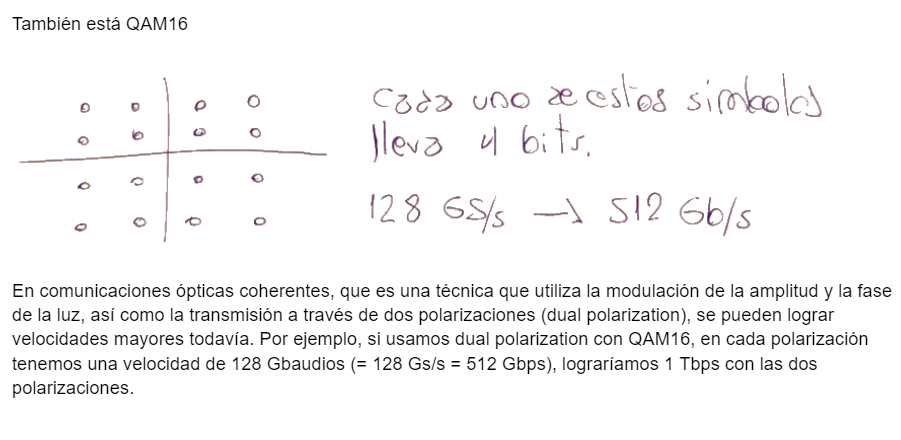

`Filtro transmisor (ipynb) <https://colab.research.google.com/drive/1TTM3s-seiJ2C7BfwcByFCVduOuGDdTeF?usp=sharing>`_ 
================================

- Probar el siguiente ejemplo:

.. code-block:: python

	import numpy as np
	import matplotlib.pyplot as plt
	plt.style.use( 'seaborn-darkgrid' )

	# ====================
	#  Generación de g[n] 
	# ====================

	fB = 32e9    # Velocidad de simbolos (baud rate)
	# Es la frecuencia de los simbolos, 32 GBaudios

	T = 1 / fB   # Tiempo entre símbolos
	M = 8        # Factor de sobremuestreo
	fs = fB * M  # Sample rate

	alpha = 0.1  # Factor de roll-off
	L = 20       # ( 2 * L * M + 1 ) es el largo del filtro sobremuestreado

	t = np.arange( -L, L, 1 / M ) * T

	gn = np.sinc( t / T ) * np.cos( np.pi * alpha * t / T ) / ( 1 - 4 * alpha**2 * t**2 / T**2 )

	fig, axs = plt.subplots( nrows = 2, ncols = 1 )
	fig.set_figwidth( 15 )
	fig.set_figheight( 10 )

	axs[ 0 ].stem( t, gn, use_line_collection = True )
	axs[ 0 ].set_title( 'Gráfico 1' )
	axs[ 0 ].set_xlabel( 'n' )
	axs[ 0 ].set_ylabel( 'gn' )

	axs[ 1 ].stem( t[ 100 : 150 ], gn[ 100 : 150 ], use_line_collection = True )
	axs[ 1 ].set_title( 'Gráfico 2' )
	axs[ 1 ].set_xlabel( 'n' )
	axs[ 1 ].set_ylabel( 'gn' )

	plt.show()

Ejercicio 1:
============

- Acercar el aspecto a la siguiente gráfica. Es decir, adornar con las leyendas, ejes de coordenadas, etc.

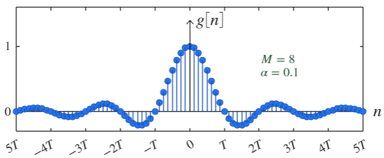

.. figure:: images/sistema_comunicaciones_2_parte1.png

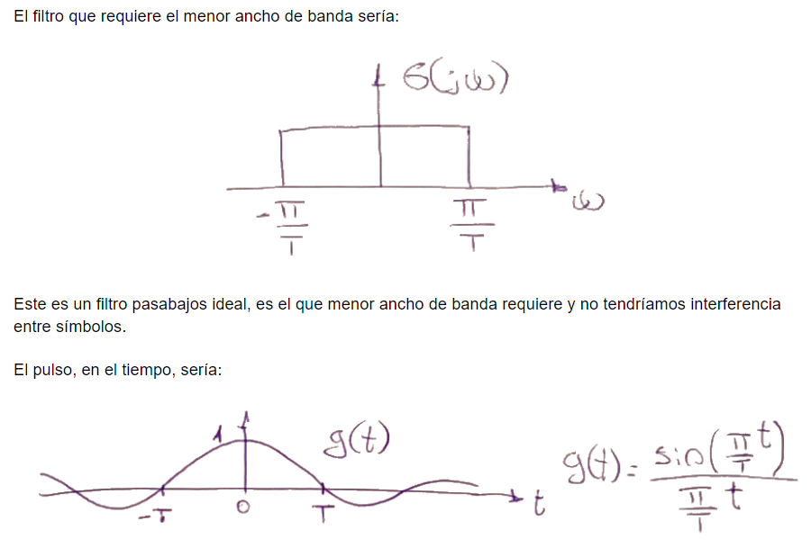

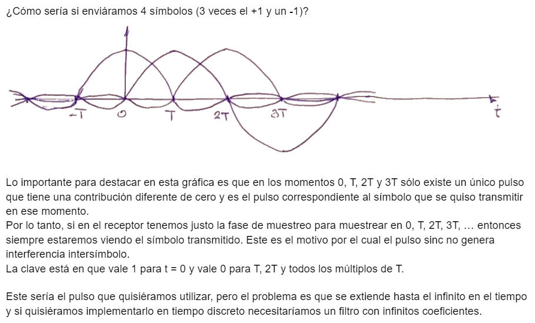

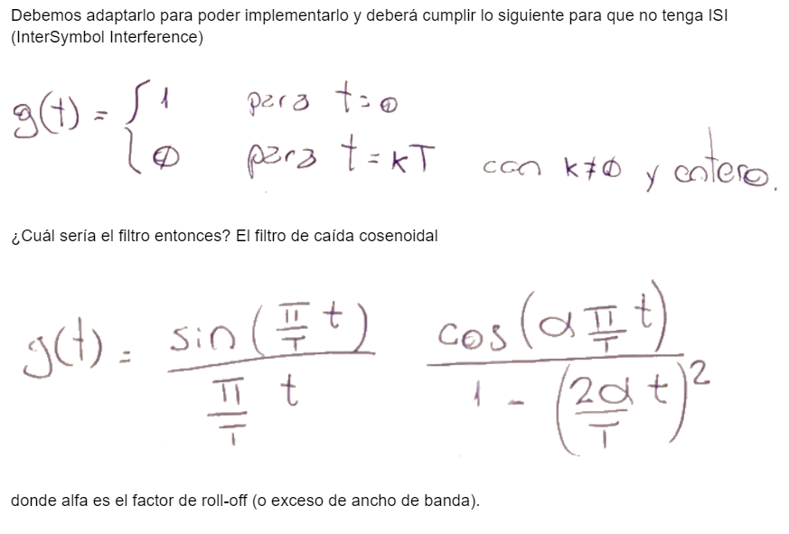

`Filtro transmisor y generador de símbolos (ipynb) <https://colab.research.google.com/drive/15fMY4bYErStiFuPmqcZip2BQ1kHlNsqh?usp=sharing>`_ 
==================================================

- El siguiente código es para graficar el filtro transmisor con un diseño en la gráfica.

.. code-block:: python

	import numpy as np
	import matplotlib.pyplot as plt
	plt.style.use( 'bmh' )

	# ====================
	#  Generación de g[n] 
	# ====================

	fB = 32e9    # Velocidad de simbolos (baud rate)
	# Es la frecuencia de los simbolos, 32 GBaudios

	T = 1 / fB   # Tiempo entre símbolos
	M = 8        # Factor de sobremuestreo
	fs = fB * M  # Sample rate

	alpha = 0.1  # Factor de roll-off
	L = 20       # ( 2 * L * M + 1 ) es el largo del filtro sobremuestreado

	t = np.arange( -L, L, 1 / M ) * T

	gn = np.sinc( t / T ) * np.cos( np.pi * alpha * t / T ) / ( 1 - 4 * alpha**2 * t**2 / T**2 )

	params = { 'legend.fontsize': 'large',
	           'figure.figsize': ( 15, 6 ),
	           'axes.labelsize': 20,
	           'axes.titlesize': 20,
	           'xtick.labelsize': 15,
	           'ytick.labelsize': 15,
	           'axes.titlepad': 30 }
	plt.rcParams.update( params )

	fig, ax = plt.subplots()

	x1_ejeVertical, y1_ejeVertical = [ 0, 0 ], [ 0, 1.5 ]
	ax.plot( x1_ejeVertical, y1_ejeVertical, linewidth = 2.5, color = 'black' )
	ax.scatter( x1_ejeVertical[ 1 ], y1_ejeVertical[ 1 ], marker = "^", color = 'black', s = 150 )

	x1_ejeHorizontal, y1_ejeHorizontal = [ -5*T, 4.9*T ], [ 0, 0 ]
	ax.plot( x1_ejeHorizontal, y1_ejeHorizontal, linewidth = 2.5, color = 'black' )

	ax.stem( t, gn, use_line_collection = True )
	ax.set_title( 'Filtro transmisor' )

	plt.text( T/6, 1.45, r'$g_{[n]}$', fontsize = 25, color = 'black' )
	plt.text( 5.2*T, 0, r'$n$', fontsize = 25, color = 'black' )

	abcisas = [ -5*T, -4*T, -3*T, -2*T, -T, 0, T/2, T, 2*T, 3*T, 4*T, 5*T ]
	textos_abcisas = [ '-5T', '-4T', r'$-3T$', '-2T', '-T', '0', r'$\frac{1}{2} \ T$', 'T', '2T', '3T', '4T', '5T' ]
	plt.xticks( abcisas, textos_abcisas )
	ordenadas = [ 0, 1 ]
	textos_ordenadas = [ '0', '1' ]
	plt.yticks( ordenadas, textos_ordenadas )

	plt.xlim( [ -5*T, 5*T ] )

	plt.show()

- El siguiente permite generar 1000 símbolos para PAM2

.. code-block:: python

	import numpy as np
	from random import randrange, seed
	import datetime

	segundos_desde_1970 = int( datetime.datetime.now().timestamp() )
	seed( segundos_desde_1970 )

	simbolos_PAM2 = np.empty( 1000 )

	for i in range( 1000 ) :
	    simbolos_PAM2[ i ] = randrange( -1, 2, 2 )

	print( simbolos_PAM2 )

Ejercicio 2:
============

- Explicar cada una de las líneas (con comentarios en el código con #) en donde se generan los símbolos.
- Generar 1.000 símbolos para PAM4: (`Aquí una lectura rápida sobre PAM4 <https://community.fs.com/es/blog/pam4-for-400g-ethernet-applications.html>`_ )

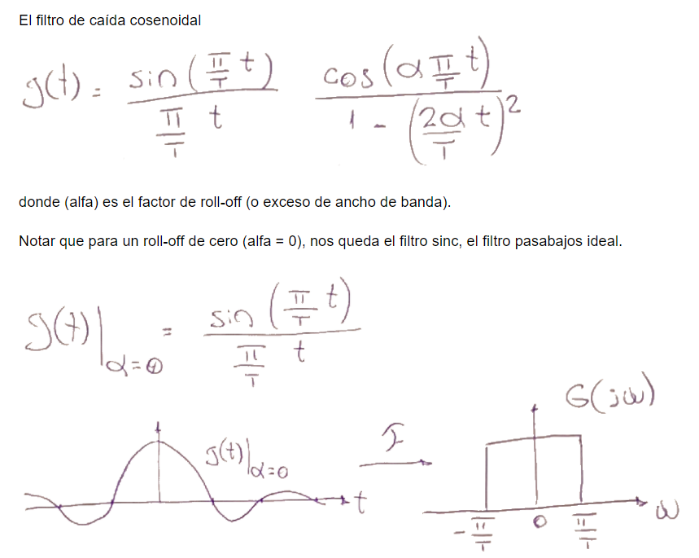

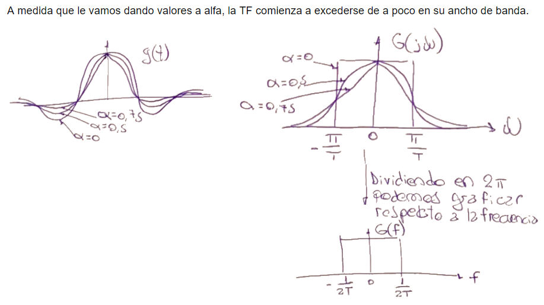

Secuencia extendida 
===================

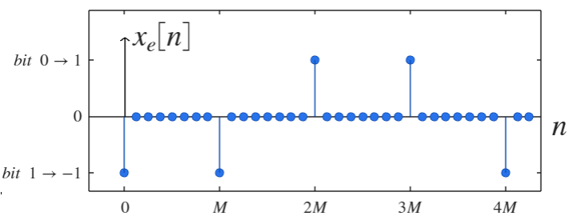

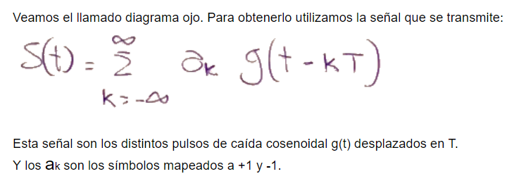

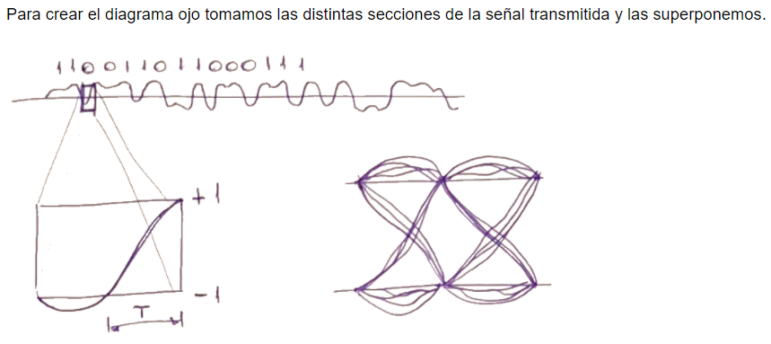

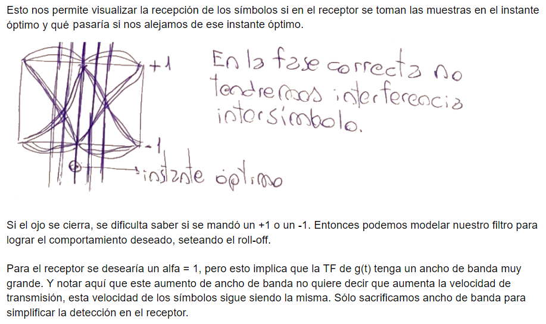

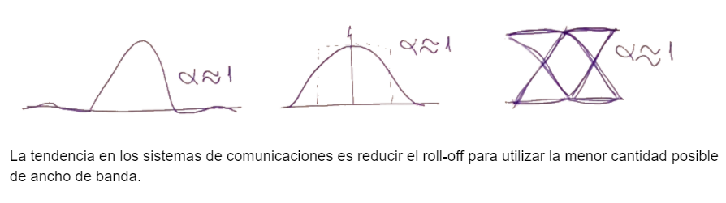

`Señal transmitida y Diagrama ojo (ipynb) <https://colab.research.google.com/drive/13AV86YDrFffWyxYTAzEgEBO6KNH6dras?usp=sharing>`_ 
================================

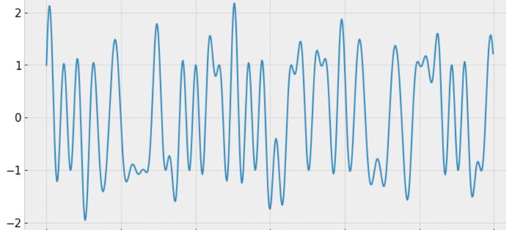

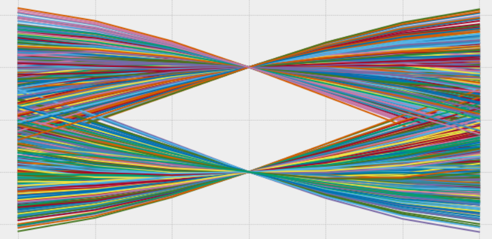

Ejercicio 3:
============

- **1-** Lograr la secuencia extendida mostrada anteriormente.

- **2-** Realizar el diagrama ojo para PAM4
- **3-** Ampliar la gráfica del diagrama ojo para visualizarla más cercana a la siguiente imagen:

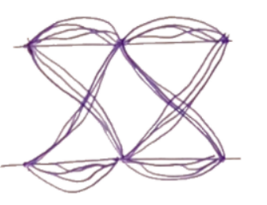

