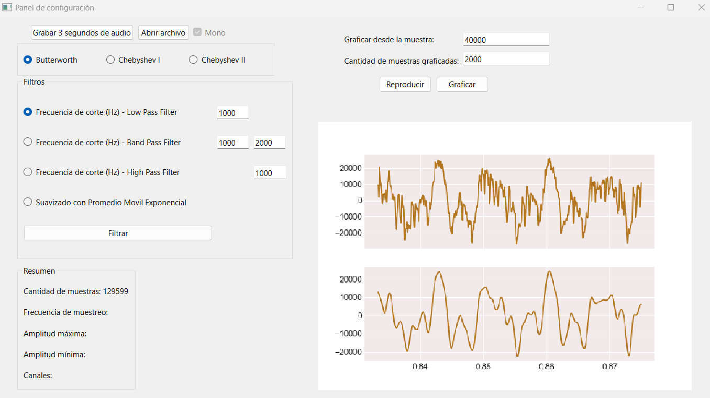

.. -*- coding: utf-8 -*-

.. _rcs_subversion:

Clase 10 - PIII 2023
====================
(Fecha: 9 de noviembre)

Para el Examen final 
--------------------

- `Rúbrica para proyecto <https://docs.google.com/spreadsheets/d/1cIXU_FKjMFStb7DhCXgr_aI6SJJ4wDYqm-0mdLYE41E/edit?usp=sharing>`_ 

Aplicar filtros digitales
=========================

- `Lectura de archivos de audio <https://docs.scipy.org/doc/scipy/reference/generated/scipy.io.wavfile.read.html>`_  

- `Filtro de Butterworth <https://docs.scipy.org/doc/scipy/reference/generated/scipy.signal.butter.html>`_  

Ejemplo para graficar sobre GUI
===============================

- `Aquí para descargar el código de este ejemplo <https://github.com/cosimani/Curso-PIII-2023/blob/main/images/gui_filtros.rar?raw=true>`_  

